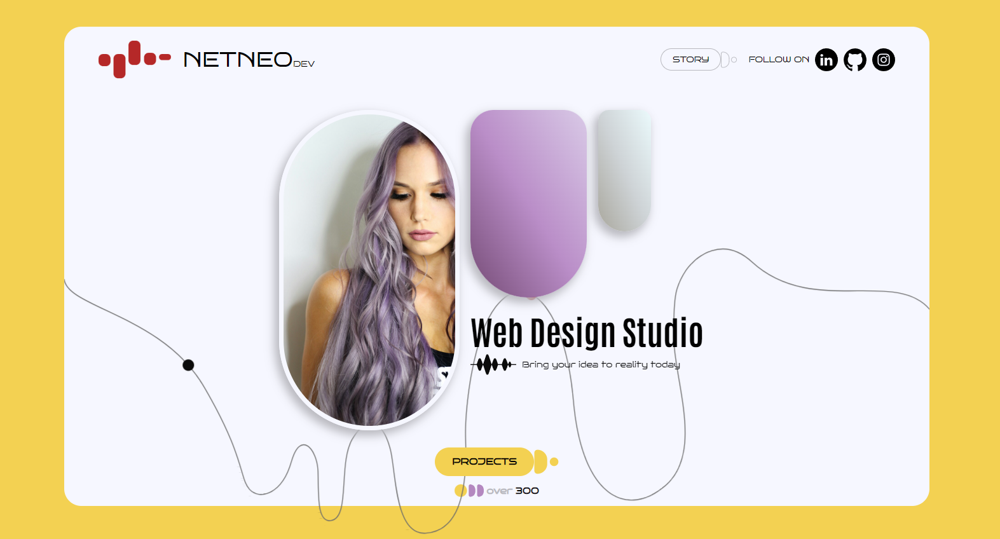

# 🌐 NetNeo Freelance Web

Welcome to my static web page project! This project was created to improve my
skills in web development and design. Below are the details of the project:

## 🚀 Project Overview

This is a static web page built with HTML, CSS, and JavaScript. The primary goal
of this project is to enhance my skills in using Figma for design, applying the
BEM methodology in CSS, creating utility classes, using CSS variables, and
implementing smooth animations with CSS keyframes and the JavaScript
Intersection Observer API.

## 📋 Features

- **Design with Figma**: The entire design was created using Figma to ensure a
  modern and user-friendly interface.
- **BEM Methodology**: Improved CSS structure using the BEM (Block Element
  Modifier) methodology for better maintainability and scalability.
- **CSS Utilities**: Created utility classes for reusable styles.
- **CSS Variables**: Utilized CSS variables for consistent and easily manageable
  theming.
- **CSS Animations**: Implemented smooth animations using CSS keyframes.
- **JavaScript Animations**: Used the Intersection Observer API for fluid
  animations that reveal elements as they come into view.
- **SVG Animations**: Practiced creating engaging SVG animations.
- **Responsive Design**: Ensured the site is fully responsive and adapts
  seamlessly to various screen sizes.

## 🌟 Technologies Used

- 
- 
- 
- 

## 🎨 Design Preview

Here are some previews of the design:

   

## 🚀Live Demo

Check out the live version [HERE!](https://freelancer-agency-web.netlify.app/).

## 📬 Contact

For any questions or suggestions, feel free to reach out to me at
netneo.web@gmail.com.
